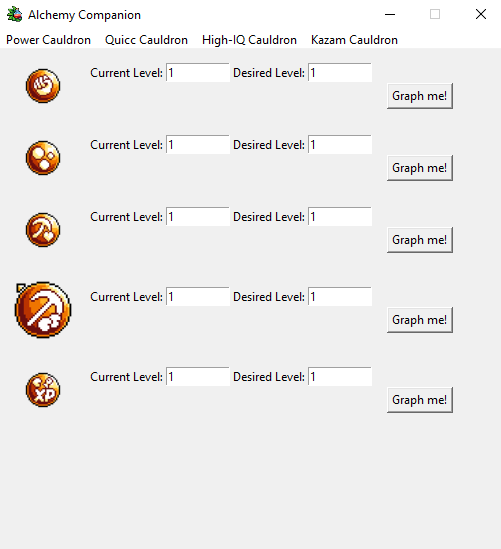
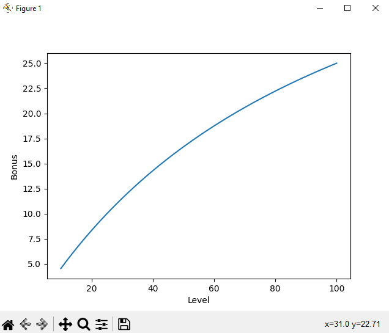

# Idleon Alchemy Companion

## This project is no longer being maintained, feel free to clone the repo and work on it yourself if you would like to.

### Features:
- Contains all alchemy bubbles in their respective cauldrons
- Ability to see bonus increase from a range of levels from x to y
- Ability to graph bubbles

### Planned Features:
- Comparing of bonuses
- Update tracker
- Different themes

